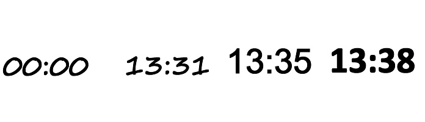

# KindleTimeMachine

The KindleTimeMachine is a set of ai generated clockfaces with a script to run them on a Kindle. This is created to go alongside my Kindlefusion project here: https://github.com/diggedypomme/Kindlefusion but can also be run standalone. I have generated an image for every minute of the day, and the clock displays this sequentially. The images were made with stable diffusion  with depth controlnet, and I will go into the settings below.These were made in May 2023, but I am just getting round to documenting. I haven't yet used it with the XL model but will give that a play.

The clockfaces that I generated so far can be previewed here: https://diggedypomme.com/clockfaces/, with mixed success. I think my favourite one is the tentacle one. The html for the preview is in the preview folder.

The kindle works best with converted black and white images, so I have included zips of the coloured and Kindle converted formats depending what you want it for. These are down at the bottom of this page and are between 100 and 300 meg per zip.
- These are currently uploading and I will update this shortly once they finish

.jpg)

## Running the clockfaces

In the "kindle" folder there are 4 files. 
- simple_eips.sh  . This tests that you can display an image
- mayclock.sh     . The actual clock script
- start_in_background . command for running this in the background
- killclock           . A script to kill a background process of the clock to stop it

You will need to update the path to match the clock name, so:

in mayclock.sh:
image_dir="/mnt/us/mayclock/anteaters"

in simple_eips.sh :
anteaters/1224.jpg or anteaters/1224.jpg

## preparing the base images
in the source_clock_image folder there are 4 files (everyminute1-4.py). Each of these will generated a different text font and layout, and you can mess with them yourself to have it how you want

- [Pack of three base clockfaces](https://superpomme.co.uk/clockfaces/baseclocks.7z)

## Stable diffusion
The images were generated based on the above clock images by using controlnet depth on the images. It was an experiment so some clockfaces turned out better than others. Reading from the metadata, the settings I used were:

Creepy picture. kraken tentacles
Steps: 30, Sampler: Euler a, CFG scale: 9, Size: 600x800, Model hash: 6ce0161689, Model: v1.5pruned_v1-5-pruned-emaonly, Version: v1.2.1, ControlNet 1: "preprocessor: scribble_pidinet, model: control_scribble-fp16 [c508311e], weight: 1, starting/ending: (0, 1), resize mode: Crop and Resize, pixel perfect: False, control mode: Balanced, preprocessor params: (512, 64, 64)"

bees
Negative prompt: blurry
Steps: 50, Sampler: Euler a, CFG scale: 7.5, Size: 600x800, Model hash: 6ce0161689, Model: v1.5pruned_v1-5-pruned-emaonly, Version: v1.2.1, ControlNet 1: "preprocessor: scribble_pidinet, model: control_scribble-fp16 [c508311e], weight: 1, starting/ending: (0, 1), resize mode: Crop and Resize, pixel perfect: True, control mode: Balanced, preprocessor params: (512, 64, 64)"

human bones. creepy
Negative prompt: blurry

Steps: 40, Sampler: DPM++ 2M Karras, CFG scale: 9, Size: 600x800, Model hash: 6ce0161689, Model: v1.5pruned_v1-5-pruned-emaonly, Version: v1.2.1, ControlNet 1: "preprocessor: scribble_pidinet, model: control_scribble-fp16 [c508311e], weight: 1, starting/ending: (0, 1), resize mode: Crop and Resize, pixel perfect: True, control mode: Balanced, preprocessor params: (512, 64, 64)"

steampunk clockwork. clock. greyscale. intricate
Negative prompt: blurry

Steps: 50, Sampler: Euler a, CFG scale: 7, Size: 600x800, Model hash: 6ce0161689, Model: v1.5pruned_v1-5-pruned-emaonly, Version: v1.2.1, ControlNet 0: "preprocessor: depth_midas, model: control_depth-fp16 [400750f6], weight: 1, starting/ending: (0, 1), resize mode: Crop and Resize, pixel perfect: True, control mode: Balanced, preprocessor params: (512, 0.5, 64)"

dragons
Negative prompt: blurry

Steps: 32, Sampler: Euler a, CFG scale: 7, Size: 600x800, Model hash: 6ce0161689, Model: v1.5pruned_v1-5-pruned-emaonly, Version: v1.2.1, ControlNet 0: "preprocessor: depth_midas, model: control_depth-fp16 [400750f6], weight: 1, starting/ending: (0, 1), resize mode: Crop and Resize, pixel perfect: True, control mode: Balanced, preprocessor params: (512, 64, 64)"

fancy clock
Negative prompt: blurry

Steps: 45, Sampler: Euler a, CFG scale: 7.5, Size: 600x800, Model hash: 6ce0161689, Model: v1.5pruned_v1-5-pruned-emaonly, Version: v1.2.1, ControlNet 1: "preprocessor: scribble_pidinet, model: control_scribble-fp16 [c508311e], weight: 1, starting/ending: (0, 1), resize mode: Crop and Resize, pixel perfect: False, control mode: Balanced, preprocessor params: (512, 64, 64)"

flowers
Negative prompt: blurry

Steps: 50, Sampler: Euler a, CFG scale: 7.5, Size: 600x800, Model hash: 6ce0161689, Model: v1.5pruned_v1-5-pruned-emaonly, Version: v1.2.1, ControlNet 1: "preprocessor: scribble_pidinet, model: control_scribble-fp16 [c508311e], weight: 1, starting/ending: (0, 1), resize mode: Crop and Resize, pixel perfect: True, control mode: Balanced, preprocessor params: (512, 64, 64)"

food photography

Steps: 40, Sampler: Euler a, CFG scale: 7, Size: 600x800, Model hash: 6ce0161689, Model: v1.5pruned_v1-5-pruned-emaonly, Version: v1.2.1, ControlNet 0: "preprocessor: depth_midas, model: control_depth-fp16 [400750f6], weight: 1, starting/ending: (0, 1), resize mode: Crop and Resize, pixel perfect: False, control mode: Balanced, preprocessor params: (512, 64, 64)"

shrooms
Negative prompt: blurry

Steps: 32, Sampler: Euler a, CFG scale: 7,  Size: 600x800, Model hash: 6ce0161689, Model: v1.5pruned_v1-5-pruned-emaonly, Version: v1.2.1, ControlNet 0: "preprocessor: depth_midas, model: control_depth-fp16 [400750f6], weight: 1, starting/ending: (0, 1), resize mode: Crop and Resize, pixel perfect: True, control mode: Balanced, preprocessor params: (512, 0.1, 0.1)"

Parrots
Negative prompt: blurry

Steps: 45, Sampler: Euler a, CFG scale: 7.5,  Size: 600x800, Model hash: 6ce0161689, Model: v1.5pruned_v1-5-pruned-emaonly, Version: v1.2.1, ControlNet 1: "preprocessor: scribble_pidinet, model: control_scribble-fp16 [c508311e], weight: 1, starting/ending: (0, 1), resize mode: Crop and Resize, pixel perfect: True, control mode: Balanced, preprocessor params: (512, 64, 64)"

snakes. creepy
Negative prompt: blurry

Steps: 30, Sampler: Euler a, CFG scale: 9,  Size: 600x800, Model hash: 6ce0161689, Model: v1.5pruned_v1-5-pruned-emaonly, Version: v1.2.1, ControlNet 1: "preprocessor: scribble_pidinet, model: control_scribble-fp16 [c508311e], weight: 1, starting/ending: (0, 1), resize mode: Crop and Resize, pixel perfect: False, control mode: Balanced, preprocessor params: (512, 64, 64)"

## conversion
I have some scripts to upload which will handle the conversion and renaming of the files, and will spit out a colour jpeg version as well as the black and white kindle ones.
Copies of 7zips of each of the clocks can be found here:

## 7zips of the clockfaces
These can be previewed here: https://diggedypomme.com/clockfaces/

- Links for the zips of these clockfaces are currently uploading and I will update this shortly once they finish:

- [Tentacles (Kindle Version)](https://superpomme.co.uk/clockfaces/tentacles.7z)
- [Tentacles Jpg (Colour Version)](https://superpomme.co.uk/clockfaces/tentacles_jpg.7z)
- [Mushrooms (Kindle Version)](https://superpomme.co.uk/clockfaces/mushrooms.7z)
- [Mushrooms Jpg (Colour Version)](https://superpomme.co.uk/clockfaces/mushrooms_jpg.7z)
- [Bones (Kindle Version)](https://superpomme.co.uk/clockfaces/bones.7z)
- [Bones Jpg (Colour Version)](https://superpomme.co.uk/clockfaces/bones_jpg.7z)
- [Clockwork (Kindle Version)](https://superpomme.co.uk/clockfaces/clockwork.7z)
- [Clockwork Jpg (Colour Version)](https://superpomme.co.uk/clockfaces/clockwork_jpg.7z)
- [Fancy (Kindle Version)](https://superpomme.co.uk/clockfaces/fancy.7z)
- [Fancy Jpg (Colour Version)](https://superpomme.co.uk/clockfaces/fancy_jpg.7z)
- [Bees (Kindle Version)](https://superpomme.co.uk/clockfaces/bees.7z)
- [Bees Jpg (Colour Version)](https://superpomme.co.uk/clockfaces/bees_jpg.7z)
- [Flowers (Kindle Version)](https://superpomme.co.uk/clockfaces/flowers.7z)
- [Flowers Jpg (Colour Version)](https://superpomme.co.uk/clockfaces/flowers_jpg.7z)
- [Parrots (Kindle Version)](https://superpomme.co.uk/clockfaces/parrots.7z)
- [Parrots Jpg (Colour Version)](https://superpomme.co.uk/clockfaces/parrots_jpg.7z)
- [Snakes (Kindle Version)](https://superpomme.co.uk/clockfaces/snakes.7z)
- [Snakes Jpg (Colour Version)](https://superpomme.co.uk/clockfaces/snakes_jpg.7z)
- [Anteaters (Kindle Version)](https://superpomme.co.uk/clockfaces/anteaters.7z)

# Kindlefusion interaction
These clocks can be started and stopped via kindlefusion, but I just need to rewrite some code as I did it directly on a kindle on holiday before giving as a gift

# To do
- redo or find the kindlefusion interaction
- add arguments for loading the different faces
- sort and upload the conversion scripts
- update the clockface preview with a link to the github and a download button for each clockface
